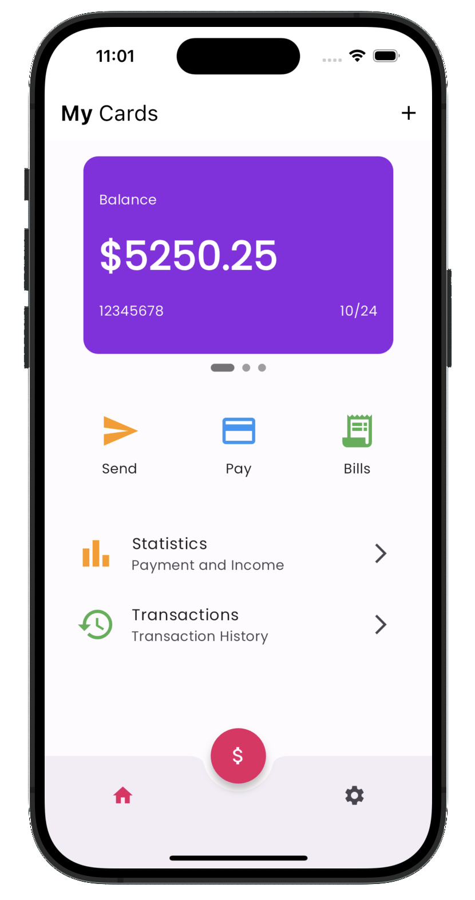

# Flutter Wallet App UI

## Overview

This Flutter app showcases a stylish wallet UI design, purely for demonstration purposes without functional backend operations.

## Screenshots

## Features

- **Stylish UI**: Beautifully designed wallet interface.
- **Carousel Slider**: Displays multiple cards with sliding functionality.
- **Custom List Tiles**: Shows statistics and transaction history.
- **Action Buttons**: Functional buttons for actions like send, pay, and bills.

## Technologies Used

- **Flutter**: Google's UI toolkit for building natively compiled applications for mobile, web, and desktop from a single codebase.
- **Dart**: The programming language used to build Flutter apps.
- **Carousel Slider**: Used for the interactive card carousel.
- **Smooth Page Indicator**: Provides smooth page transition effects in the app.
- **Linting**: The codebase adheres to best practices and coding standards using lint rules.
- **Widget Tests**: Extensive use of widget tests to ensure the robustness of the UI components, behaviors, and overall application functionality.

## License
This project is licensed under the MIT License - see the [LICENSE](LICENSE) file for details.